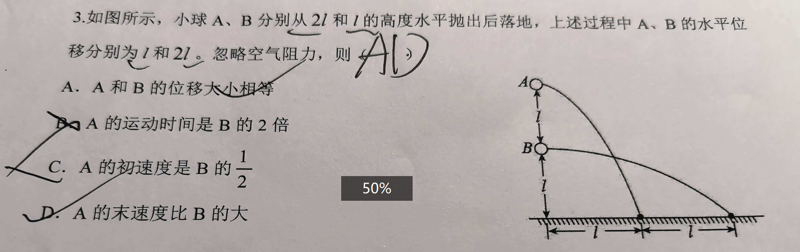
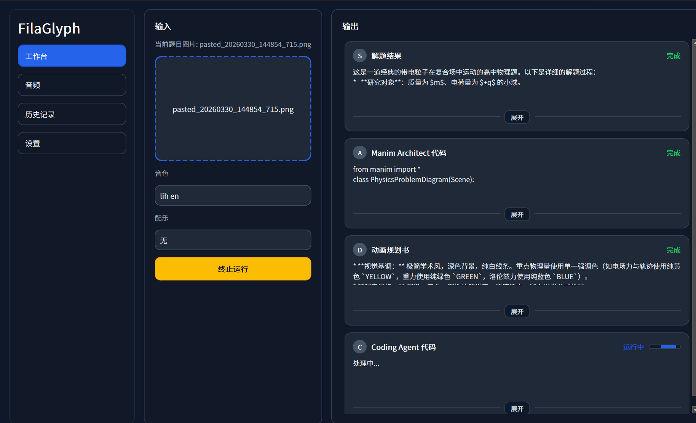
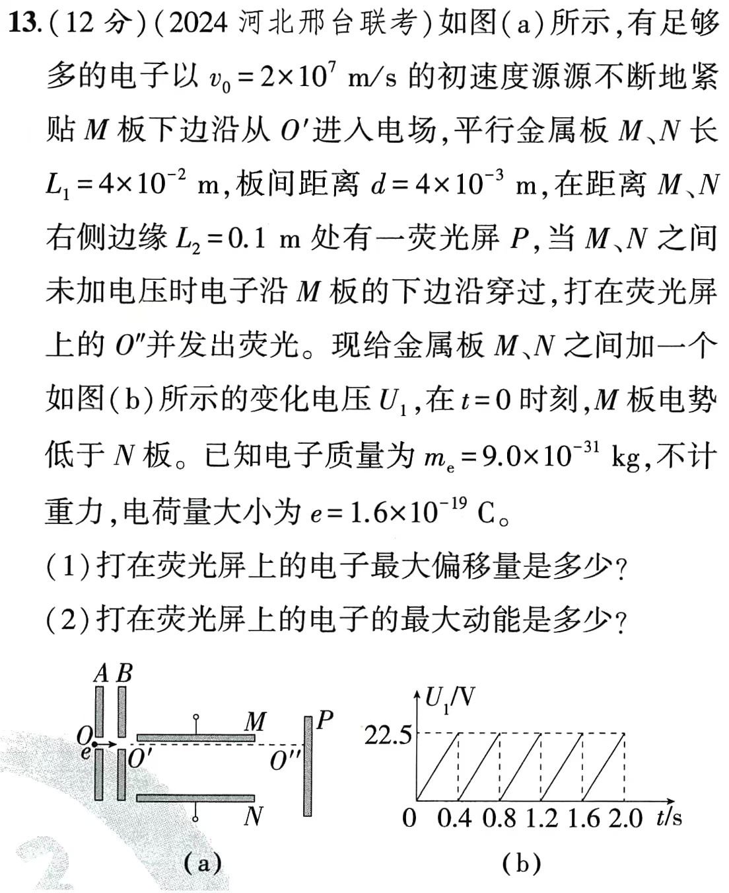

FilaGlyph 1.0是生成3Blue1Brown风格讲解视频的agent workflow软件，用户将题目图片上传后开启工作流，最终获得manim动画，带配音讲解的视频演示。

生成的动画对原题的配图有很高的还原度

import gui_show from "./examples/gui_show.mp4";
import pingpao_lesson from "./examples/pingpao_lesson.mp4";
import magne_lesson from "./examples/magne_lesson.mp4";
import plex_lesson from "./examples/plex_lesson.mp4";

1. 

题目图片：

桌面应用程序：

<video controls preload="metadata" style={{ width: "100%", borderRadius: "12px" }}>
  <source src={gui_show} type="video/mp4" />
  你的浏览器不支持 video 标签。
</video>

output:

<video controls preload="metadata" style={{ width: "100%", borderRadius: "12px" }}>
  <source src={pingpao_lesson} type="video/mp4" />
  你的浏览器不支持 video 标签。
</video>

这个例子用的音频是没有设置语音原文的，所以调用跨语言复刻模式。虽然配音生动，但稳定性不够完美，不适用于严肃教学场景。

2. 

题目图片：

桌面应用程序:

output:

<video controls preload="metadata" style={{ width: "100%", borderRadius: "12px" }}>
  <source src={magne_lesson} type="video/mp4" />
  你的浏览器不支持 video 标签。
</video>

设置了语音原文后，复刻得就很好了，把我那不太标准的煲冬瓜也学了，连换气的声音都时不时来几下，除了音色还有点不像。

这非常好用啊！

我那物理答疑的兼职，选择题一道6块钱，大题一道十块钱，但无论任何题，只要用视频答疑就是15块！没错，我搞这个项目就是为了**薅羊毛**。
However一些宏大的目标比如给老师提供非常方便的讲解视频制作工具确实给了我合理的继续下去的理由。

也许这个项目可以用来给老师做课堂教学，给教培机构做讲解。甚至可以做各种pre和会议时放在ppt。

最后展示一个复杂题目的视频

题目：

<video controls preload="metadata" style={{ width: "100%", borderRadius: "12px" }}>
  <source src={plex_lesson} type="video/mp4" />
  你的浏览器不支持 video 标签。
</video>